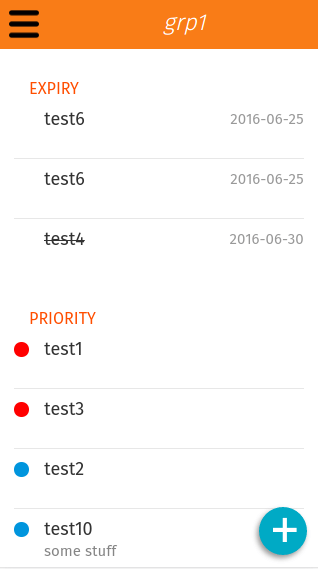

# My Custom Todo WebApp (ﾉ◕ヮ◕)ﾉ*:･ﾟ✧

> It's a WebApp optimzed for [Firefox OS 1.0 up to 2.5](https://www.mozilla.org/de/firefox/os/), but will works on Android and <strike>iOS</strike> legacy phones too

Goal is to build a todo webapp who provide 

* Server (CouchDB) synchronization
* Backup export, import ✓
* Todo dependencies 
* Prioritization ✓

## Build with 
 * [Mozilla buildingfirefoxos.com](http://buildingfirefoxos.com), ([github](https://github.com/buildingfirefoxos/Building-Blocks))
 * [KnockoutJS](http://knockoutjs.com)
 * [PouchDB](https://pouchdb.com)
 * [fecha](https://github.com/taylorhakes/fecha)
 * [google-webfonts-helper](https://google-webfonts-helper.herokuapp.com/fonts) <- thx for this tool
 * [Launcher Icon Maker](https://appmaker.merq.org/tools) & [iconogen.com](http://iconogen.com)

## Screenshots



## User story

As a **FirefoxOS user** I want to have a todo app who will rember me on important stuff
so that I can outsource my brain capacity to the phone, yeai

### Acceptance criteria

- [x] groups can be saved and deleted
- [x] todos can be saved, toggeled and deleted
- [x] todos will be shown in a list
- [x] todos will be shown filtered by group
- [x] todos will be ordered by priority
- [x] and by date
- [x] priority will be signaled by color
- [x] start screen, when first start
- [ ] settings will be loaded on startup (language/couchdb)
- [ ] synchronization to a CouchDB works
- [ ] todos can be edit
- [ ] links in the todo description will be shown as html link in the edit mode
- [ ] it will show a message if a todo has been toggle with an unsolved dependency (other todo is not done)
- [ ] group delete will show a confirm message and delete all dependet todos 
- [ ] app will run on FXOS 1.1
- [ ] app will run on android and ios

### Feature whishlist

- [x] DB export to JSON file
- [x] read JSON file and import to DB
- [ ] phone will [vibrate](https://www.sitepoint.com/use-html5-vibration-api) while notify is poping up
- [ ] open input form whit phone [shaking](https://github.com/alexgibson/shake.js) [1](http://qnimate.com/detect-shake-using-javascript)
- [ ] sharing lists with [other user](https://github.com/nolanlawson/pouchdb-authentication) via couchdb accounts
- [ ] show all groups with all todos in a [pie chart](http://www.chartjs.org/docs/#doughnut-pie-chart-introduction) like landingpage by [small and big dots](https://media-mediatemple.netdna-ssl.com/wp-content/uploads/2016/03/02-beats-opt.jpg)
- [ ] transaltion can be added
- [ ] it will prefer the system default language
- [ ] LTR/RTL works
- [ ] Android [web](https://developer.chrome.com/multidevice/android/intents) [intents](http://webintents.org/#support) has been tested
- [ ] themes (ios, android, cyberUI)
- [ ] archivements for completing todos
- [ ] [crypto-pouch](https://github.com/calvinmetcalf/crypto-pouch) ausprobieren

### Feature Table

|  | FirefoxOS ||| Android  || iOS  ||
| --- | --- | --- | --- | --- | --- | --- | --- | --- |
| **OS Version** | **1.1** | **2.0** | **2.6** | **4.3** | **5** | **5** | **6** |
| **onbording startscreen** | ✓ | ✓ | ✓ ||||
| **DB Backup Export** | ❌ | ✓ |  | ✓ | ✓ | ❌ | ❌ |
| **DB Backup Import** | ❌ | ✓ |  | ✓ | ✓ | ❌ | ❌ |

### Bugs

- [ ] settings form muss umgebaut werden, sync form hoch, onkeyup raus und save button fixen
- [ ] overlay menu kann nict gescrollt werden
- [ ] build is not up to date
- [ ] **heisenbug** - viewModel.js:75 Uncaught TypeError: Cannot set property 'className' of null
- [ ] won't reload after json import

## CouchDB

if you want to sychronize your data, you need to install and configure a [CouchDB](https://couchdb.apache.org)
* [how to install couchdb and futon on ubuntu 14 04](https://www.digitalocean.com/community/tutorials/how-to-install-couchdb-and-futon-on-ubuntu-14-04)
* [how to install couchdb on a RaspberryPI - Raspbian Jessie](http://jeeonthepi.blogspot.ch/2014/08/installing-couchdb-1.html)

when you done this and login to Futon, create following databases

* *couchdb-databbase-prefix-***group**
* *couchdb-databbase-prefix-***todo**

then configure your app in 

> menu -> Database -> Sync to CouchDB

choose somthing clear as prefix like **my-fxos-todo-app-** or leave this blank if you don't wan't to use your CouchDB for something else

# Development

## Install
```
npm install
gulp build
```
and run a webserver
```
npm run web
```
then click on [http://127.0.0.1:8000](http://127.0.0.1:8000)

## CouchDB setup 

if you want to work on the synchronization and need to debug in your Chrome browser,
you need to enable [CORS](https://en.wikipedia.org/wiki/Cross-origin_resource_sharing) in your [CouchDB](https://couchdb.apache.org)

[github.com/pouchdb/add-cors-to-couchdb](https://github.com/pouchdb/add-cors-to-couchdb#what-it-does)

*CouchDB doesn't come with CORS enabled by default. This is a problem for libraries like PouchDB, which depend on being able to access CouchDB ...*